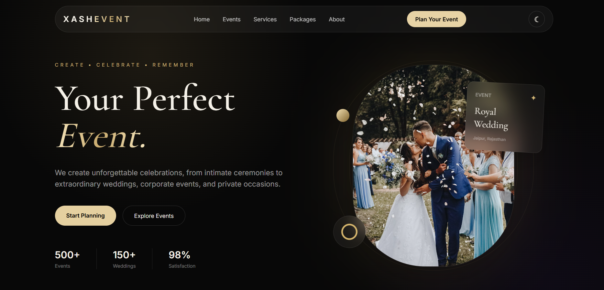
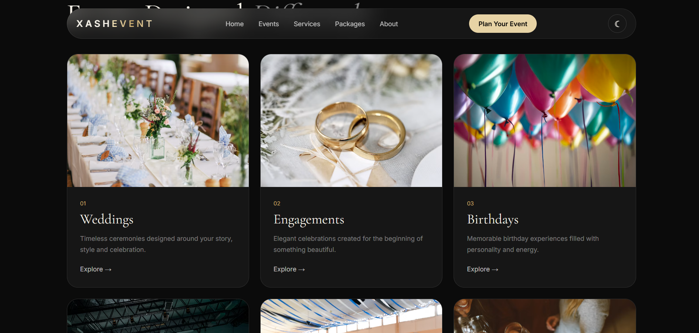
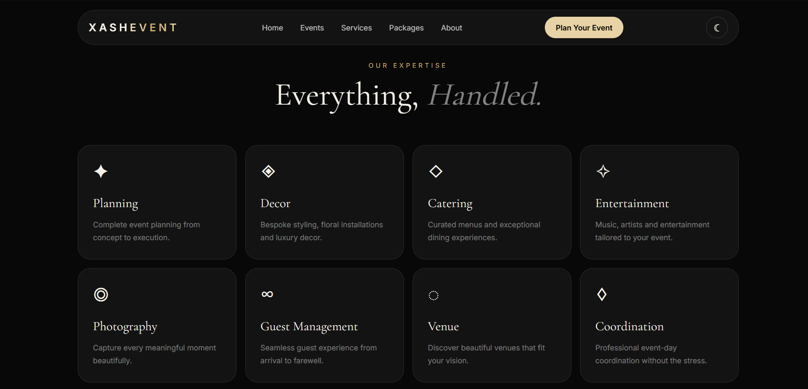
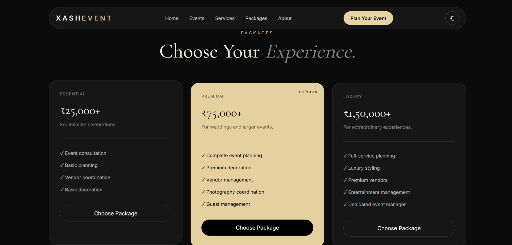
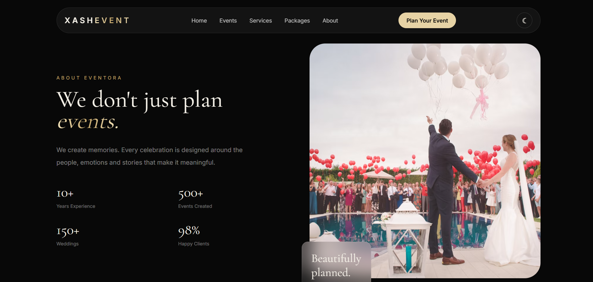
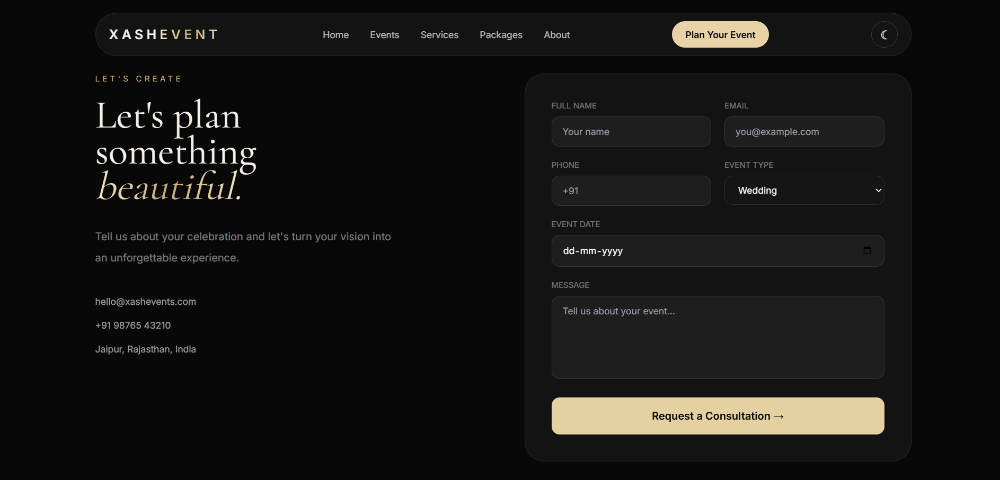

# XASHEVENT — Luxury Event Planner

A modern, responsive luxury event-planning website built with **HTML5 and Tailwind CSS**.  
The design uses a premium dark aesthetic with gold accents, glassmorphism cards, elegant typography, responsive layouts, and a CSS-only dark/light theme toggle.

## ✨ Project Overview

**XASHEVENT** is a luxury event planner landing website designed for showcasing premium event-planning services such as weddings, engagements, birthdays, corporate events, private parties, and anniversaries.

The website focuses on a clean, cinematic and premium visual experience with:

- Luxury dark theme with gold accents
- CSS-only dark/light theme toggle
- Responsive navigation
- Hero section with event-planner branding
- Event category cards
- Services section
- Featured wedding experience
- Event planning process
- Pricing packages
- About section
- Client testimonial
- Contact/consultation form
- Responsive footer

## 🛠️ Tech Stack

- **HTML5** — Website structure
- **Tailwind CSS** — Styling and responsive layout
- **Google Fonts** — Cormorant Garamond + Inter
- **CSS** — Theme toggle and custom visual effects
- **AVIF Images** — Optimized website imagery


## 📌 Website Sections

### 1. Home / Hero
Premium hero section introducing the event-planning brand with:
- Main headline
- Event description
- CTA buttons
- Event statistics
- Hero image
- Featured event card

### 2. Events
Showcases different types of events:

- Weddings
- Engagements
- Birthdays
- Corporate Events
- Private Parties
- Anniversaries

### 3. Services
The website presents eight core services:

- Planning
- Decor
- Catering
- Entertainment
- Photography
- Guest Management
- Venue
- Coordination

### 4. Featured Experience
A highlighted **Royal Garden Wedding** experience featuring:
- Jaipur location
- 250 guests
- Luxury wedding description
- Large visual section

### 5. Process
The event planning workflow is presented in four steps:

1. Discover
2. Design
3. Plan
4. Celebrate

### 6. Packages
Three pricing packages are displayed:

| Package | Starting Price | Best For |
|---|---:|---|
| Essential | ₹25,000+ | Intimate celebrations |
| Premium | ₹75,000+ | Weddings and larger events |
| Luxury | ₹1,50,000+ | Extraordinary experiences |

### 7. About
Brand introduction with:
- Experience statistics
- Events created
- Weddings
- Happy clients

### 8. Testimonial
A customer testimonial section highlighting the Royal Garden Wedding experience in Jaipur.

### 9. Contact
Consultation form containing:

- Full Name
- Email
- Phone
- Event Type
- Event Date
- Message
- Consultation CTA

### 10. Footer
Includes navigation links, brand description, copyright information and service locations.

---

## 🎨 Design Features

- Premium black and gold visual language
- Glassmorphism cards
- Soft gradients
- Rounded modern UI
- Elegant serif typography for headings
- Inter font for body text
- Hover animations
- Responsive grid layouts
- Image hover scaling
- Smooth visual transitions
- CSS-only light/dark theme switch

## 🌗 Theme Toggle

It uses:

- Hidden HTML checkbox
- `<label>` as the toggle button
- CSS `:checked` selector
- Custom CSS variables/styles and Tailwind utility classes

This keeps the theme functionality lightweight and avoids JavaScript-based theme logic.

## 📁 Folder Structure

Use the following project structure:

```text
XASHEVENT/
│
├── index.html
├── README.md
│
└── assets/
    ├── hero.avif
    ├── 2.avif
    ├── 3.avif
    ├── 4.avif
    ├── 5.avif
    ├── 6.avif
    ├── 7.avif
    ├── 8.avif
    └── 9.avif
```


## 📸 Screenshots

Add your website screenshots inside a `screenshots` folder.

Recommended structure:

```text
XASHEVENT/
│
├── index.html
├── README.md
├── assets/
│   └── ...
│
└── screenshots/
    ├── home.png
    ├── events.png
    ├── services.png
    ├── packages.png
    ├── about.png
    └── contact.png
```

### Website Preview

#### 🏠 Home / Hero



#### 🎉 Events Section



#### ✦ Services Section



#### 💎 Packages Section



#### 👑 About Section



#### 📩 Contact Section




## 🌐 Live Demo

[Visit XASHEVENT Live Website](https://xashevent.vercel.app/)

## 📱 Responsive Design

The website is designed to work across:

- Desktop
- Laptop
- Tablet
- Mobile

Tailwind CSS responsive utility classes are used throughout the layout.

## 🔗 Navigation

The main navigation provides links to:

- Home
- Events
- Services
- Packages
- About
- Contact

The primary CTA is **Plan Your Event**.

## 📊 Project Highlights

- Modern luxury UI
- Responsive design
- Semantic HTML structure
- Tailwind CSS utility classes
- CSS-only theme switching
- Optimized AVIF images
- Accessible form labels
- Hover and transition effects
- Mobile-friendly layout
- No React dependency


## 👨‍💻 Author

**Yash**

Built as a modern luxury event-planning website project.

---

## 📄 License

This project is created for learning, portfolio and demonstration purposes.
